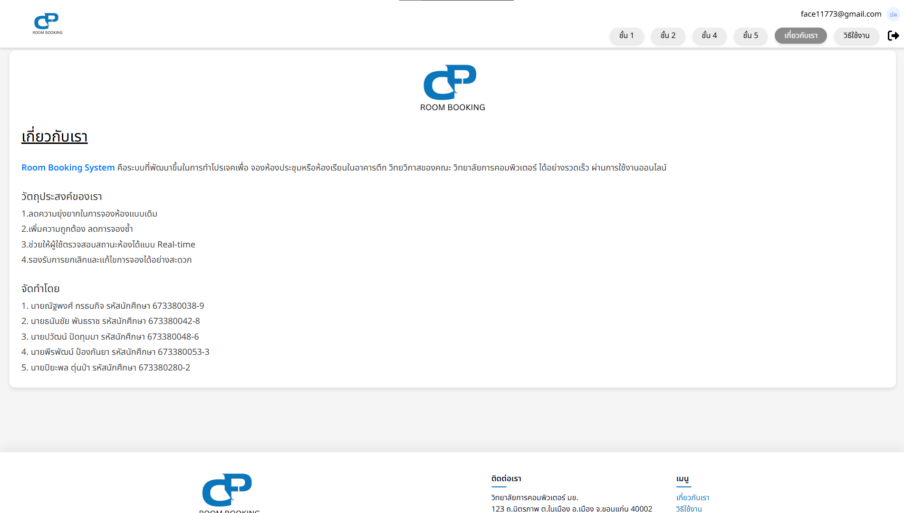

# 🏢 Booking CP System (ระบบจองห้องเรียน/ห้องประชุม)

เป็นระบบเว็บแอปพลิเคชันสำหรับจัดการการจองห้องเรียนหรือห้องประชุมภายในอาคาร ถูกพัฒนาด้วย Laravel Framework โดยมีฟีเจอร์สำหรับการเลือกชั้น, ดูสถานะห้องว่าง/ไม่ว่าง, ทำการจอง, ดูประวัติการจองของผู้ใช้, และระบบจัดการคำขอจองสำหรับผู้ดูแลระบบ (Admin)

---

## 💻 แนะนำหน้าจอการใช้งาน (Pages & Features)

### 1. หน้าเข้าสู่ระบบและสมัครสมาชิก (Login / Register)
หน้าสำหรับการเข้าสู่ระบบของสมาชิกและผู้ดูแลระบบ รวมถึงการสมัครสมาชิกใหม่ (รองรับระบบ 인증 ผ่าน Laravel Jetstream)
<br>

<br>


### 2. หน้าหลัก / แผนผังแต่ละชั้น (Floor 1, 2, 4, 5)
แสดงรายละเอียดและแผนผังของห้องแต่ละชั้น สถานะปัจจุบันของห้อง และปุ่มให้ผู้ใช้กดเลือกห้องที่ต้องการจอง
<br>

<br>

<br>

<br>


### 3. หน้าจองห้อง (Booking Page)
แบบฟอร์มให้ผู้ใช้ทำการจองห้องที่เลือก โดยแสดงข้อมูลห้องนั้นๆ และให้กรอกรายละเอียด วัน เวลาเริ่มต้น-สิ้นสุด และจุดประสงค์ในการใช้งาน
<br>


### 4. หน้าประวัติการจอง (Booking History)
แสดงรายการคำขอจองห้องของผู้ใช้งาน พร้อมระบุสถานะ (เช่น รออนุมัติ, อนุมัติแล้ว, ถูกปฏิเสธ) รวมไปถึงปุ่มสำหรับแก้ไข/ยกเลิกคำขอในกรณีที่ยังไม่ได้รับการอนุมัติ
<br>


### 5. หน้าจัดการคำขอจองสำหรับผู้ดูแลระบบ (Admin Dashboard)
เฉพาะผู้ใช้ระดับผู้ดูแลระบบ (Admin) เท่านั้นที่จะเข้าถึงได้ ใช้ตรวจสอบ อนุมัติ (Approve) ปฏิเสธ (Reject) ดัดแปลง (Update) หรือลบประวัติการจองห้องจากผู้ใช้งานในระบบ
<br>


### 6. หน้าคู่มือการใช้งาน (Guide)
คำแนะนำและวิธีการใช้งานระบบจองห้องอย่างละเอียด สำหรับผู้ใช้ใหม่
<br>


### 7. หน้าจัดการประวัติส่วนตัว (Profile)
หน้าสำหรับจัดการข้อมูลส่วนตัวของผู้ใช้งาน เปลี่ยนรหัสผ่าน และตั้งค่าบัญชี
<br>
)" alt="Profile Page" width="800">

### 8. หน้าเกี่ยวกับเรา (About)
แสดงข้อมูลรายละเอียดเกี่ยวกับผู้จัดทำโปรเจกต์
<br>


---

## 🚀 วิธีการติดตั้งและใช้งานเบื้องต้น (Installation & Usage)

1. **โคลนโปรเจกต์ (Clone the repository)**
   ```bash
   git clone <repository-url>
   cd Booking-CP-system
   ```

2. **ติดตั้ง Dependencies**
   ```bash
   composer install
   npm install
   ```

3. **คัดลอกไฟล์ตั้งค่า Environment (.env)**
   ```bash
   cp .env.example .env
   ```

4. **สร้าง Application Key**
   ```bash
   php artisan key:generate
   ```

5. **ตั้งค่าฐานข้อมูล (Database Configuration)**
   เปิดไฟล์ `.env` และแก้ไขค่า `DB_DATABASE`, `DB_USERNAME`, และ `DB_PASSWORD` ให้ตรงกับระบบจัดการฐานข้อมูล (เช่น MySQL หรือ MariaDB)

6. **รัน Migration และ Seed (สร้างตารางและข้อมูลเริ่มต้น)**
   ```bash
   php artisan migrate --seed
   ```

7. **รันเซิร์ฟเวอร์ (Run Local Server)**
   เปิด 2 Terminal เพื่อรันคำสั่งต่อไปนี้พร้อมกัน:
   ```bash
   # Terminal 1: สำหรับรันฝั่ง Frontend (Vite)
   npm run dev

   # Terminal 2: สำหรับรันฝั่ง Backend (Laravel)
   php artisan serve
   ```
   จากนั้นเปิดเบราว์เซอร์แล้วเข้าสู่ `http://localhost:8000` ตามที่ระบบแสดง

---

## 👥 ผู้จัดทำ (Team Members)

| Profile | รหัสนักศึกษา | ชื่อ-นามสกุล | Section |
| :---: | :---: | :--- | :---: |
| <a href="https://github.com/Catsack423"></a> | 673380280-2 | นายปิยะพล ตุ่นป่า | 1 |
| <a href="https://github.com/SandKingTH"></a>  | 673380053-3 | นายพีรพัฒน์ ป้องกันยา | 1 |
| <a href="https://github.com/NongpandarX"></a> | 673380042-8 | นายธนันชัย พันธราช | 1 |
| <a href="https://github.com/nattapong-61"></a> | 673380038-9 | นายณัฐพงศ์ กรธนกิจ | 1 |
| <a href="https://github.com/kixmbap"></a>  | 673380048-6 | นายปวัฒน์ ปัดทุมมา | 2 |

---

## 💾 Database Initial Data (Room Seed)
ข้อมูลเริ่มต้นของห้องในระบบ (ตัวอย่าง Table `room`):
```sql
INSERT INTO `room`(`id`,`day`) VALUES ('CP9127','null');
INSERT INTO `room`(`id`,`day`) VALUES ('CP9228','null');
INSERT INTO `room`(`id`,`day`) VALUES ('CP9227','null');
INSERT INTO `room`(`id`,`day`) VALUES ('CP9226','null');
INSERT INTO `room`(`id`,`day`) VALUES ('CP9422','null');
INSERT INTO `room`(`id`,`day`) VALUES ('CP9421','null');
INSERT INTO `room`(`id`,`day`) VALUES ('CP9525','null');
INSERT INTO `room`(`id`,`day`) VALUES ('CP9524','null');
```
